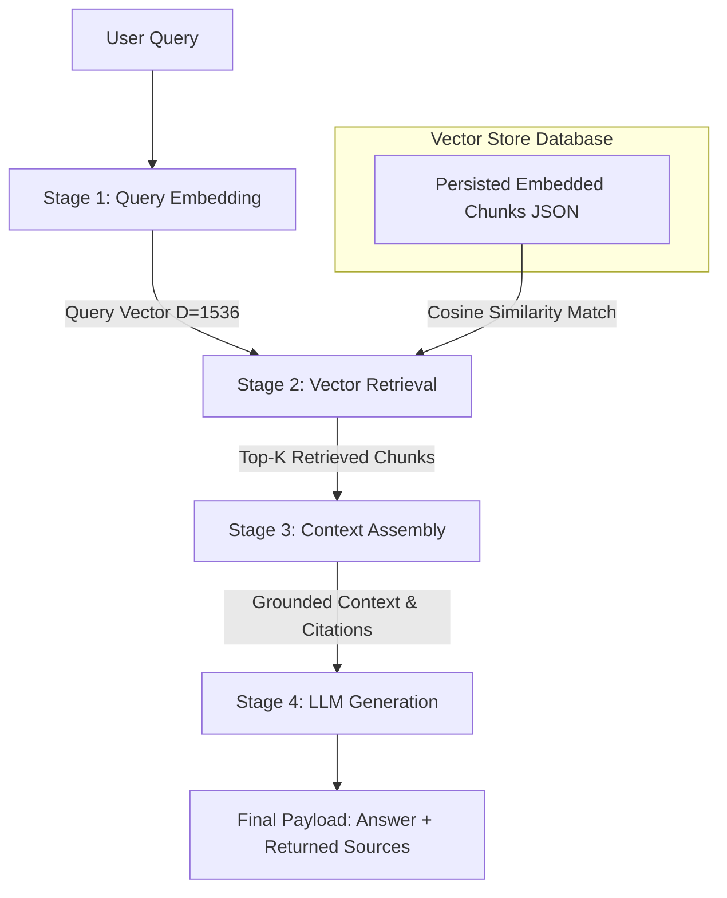

# End-to-End RAG Pipeline Architecture & Flow Design

## Architectural Flow Overview

The Retrieval-Augmented Generation (RAG) pipeline coordinates four decoupled, testable execution stages to transform a user query into a grounded, factual answer with verified source citations:



---

## Pipeline Stage Breakdown

### Stage 1: Query Embedding (`stage_embed_query`)
- **Input**: User prompt string (e.g. *"What is the policy for paid time off and leave rollover?"*).
- **Process**: Converts raw text into a 1536-dimensional dense embedding vector with $L_2$ unit normalization ($\|\mathbf{v}\|_2 = 1.0$) using the identical embedding model employed during corpus ingestion.
- **Output**: 1536-element float list representing semantic direction in vector space.

### Stage 2: Vector Retrieval (`stage_retrieve_chunks`)
- **Input**: Query text (or query vector), parameter $k$ (default: 3), optional `score_threshold` (default: 0.0), and optional `metadata_filter`.
- **Process**: Performs cosine similarity search against indexed corpus chunks in `data/embedded_chunks.json` / `data/indexed_collection.json`. Filters out low-confidence noise or out-of-scope metadata tags, and ranks candidate chunks descending by similarity score.
- **Output**: Ranked list of `RetrievedChunk` objects containing `rank`, `score`, `chunk_id`, `source_text`, and rich retrieval metadata (`source_document`, `chunk_index`, `section`, `page`).

### Stage 3: Context Assembly (`stage_assemble_context`)
- **Input**: List of `RetrievedChunk` objects and `max_context_tokens` budget (default: 1500 tokens).
- **Process**: Formats retrieved chunks into a clean, structured context block with clear source demarcations (`[Source N: doc_name | Section: section | Page: page]`). Enforces context token limits to prevent prompt context bloat.
- **Output**: Tuple of `(context_block_str, returned_sources_list)`.

### Stage 4: Answer Generation (`stage_generate_answer`)
- **Input**: User query, assembled context block, returned sources list, system prompt template (`STAFF_ASSISTANT_SYSTEM_PROMPT`), and model settings.
- **Process**: Renders the complete prompt using `render_rag_request(context, query)`. Invokes LLM chat completion API (or fallback deterministic grounded answer generator if offline/unconfigured). Enforces strict grounding: if context lacks information, returns official HR/IT helpdesk fallback statement.
- **Output**: Final RAG payload dictionary containing:
  - `query`: Original user prompt
  - `answer`: Grounded response text
  - `returned_sources`: List of formatted source citations (`chunk_id`, `document`, `section`, `page`, `similarity_score`)
  - `retrieved_chunk_count`: Number of chunks used
  - `stage_metrics`: Execution statistics across all 4 stages.

---

## End-to-End Execution Sample Output Payload Structure

```json
{
  "query": "How many days of paid time off do employees get each year, and can unused PTO be rolled over?",
  "answer": "Full-time regular employees accrue 18 days of Paid Time Off (PTO) per calendar year. Employees are permitted to roll over a maximum of 5 unused PTO days into the following calendar year, which must be used by March 31.",
  "returned_sources": [
    {
      "rank": 1,
      "chunk_id": "employee_benefits_chunk_001",
      "source_document": "employee_benefits.md",
      "section": "Section 6.0: Employee Benefits, Paid Time Off & Leave Guidelines > 1. Paid Time Off (PTO) Accrual",
      "page": null,
      "similarity_score": 0.5269,
      "token_count": 79
    }
  ],
  "retrieved_chunk_count": 3,
  "stage_metrics": {
    "embed_dimension": 1536,
    "top_similarity_score": 0.5269,
    "context_tokens": 225,
    "generation_model": "OpenAI-Compatible API (text-embedding-3-small)"
  }
}
```
